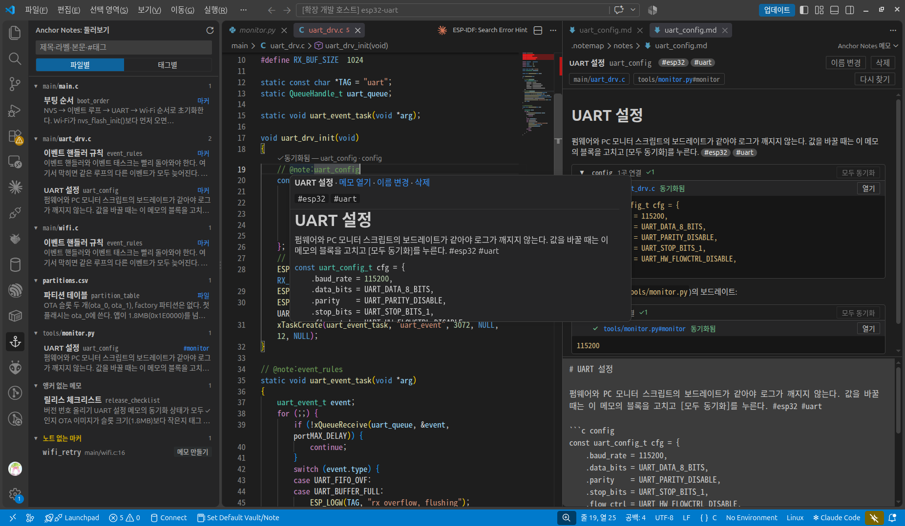
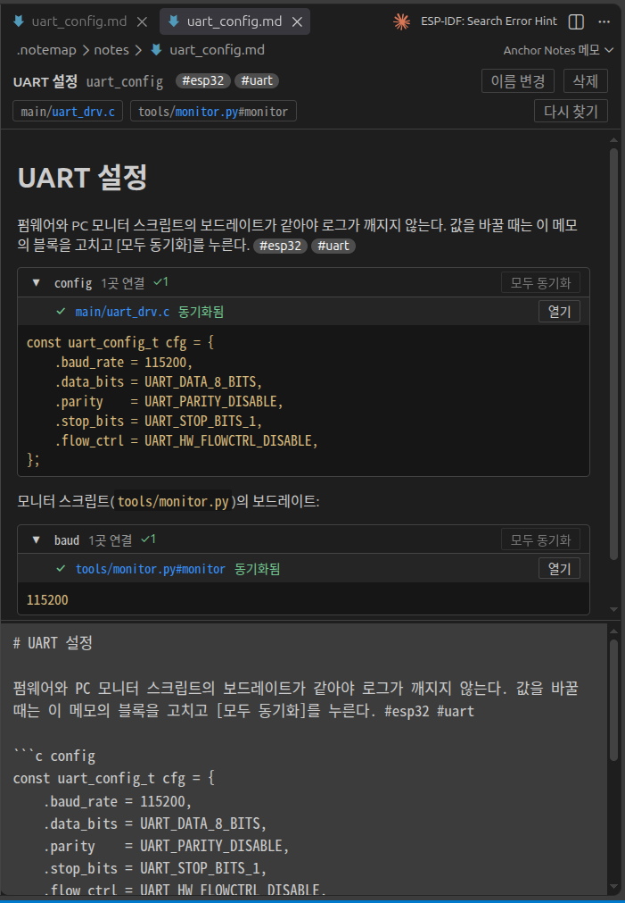
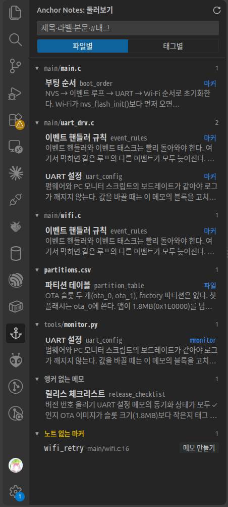

# Anchor Notes

소스 코드에 심은 **마커(`@note:라벨`)** 에 마크다운 메모를 붙이는 VSCode 확장입니다.

메모는 줄 번호가 아니라 코드 안의 마커에 붙습니다. 코드를 고치거나 옮겨도 마커가 코드와 함께 움직이므로 메모가 엉뚱한 줄을 가리키지 않습니다. 메모는 워크스페이스 안의 마크다운 파일로 저장되어 git으로 함께 관리되고, Obsidian에서도 그대로 열립니다.



## 특징

- **작업 중인 에디터에서 바로** — 단축키 하나로 이 줄에 메모를 만들거나 엽니다. 다른 화면을 먼저 열 필요가 없습니다.
- **마커 기반** — 메모 위치를 코드 안에 둡니다. 여러 파일, 여러 줄에 같은 메모를 붙일 수 있습니다.
- **마크다운 파일로 저장** — `.notemap/notes/라벨.md`. git diff로 읽히고 Obsidian에서 열립니다.
- **메모 에디터** — 위 미리보기, 아래 입력. 앵커 칩으로 코드 위치로 이동합니다.
- **태그** — 본문의 `#태그`로 메모를 묶고 찾습니다.
- **코드 넣기·동기화** — 메모 안의 코드 블록을 소스에 넣거나, 소스의 특정 범위와 연결해 어느 쪽이 바뀌었는지 보여줍니다.
- **둘러보기** — 사이드바에서 모든 메모를 파일별·태그별로 보고 검색합니다.

## 빠른 시작

1. 폴더를 VSCode로 엽니다 (메모는 첫 번째 워크스페이스 폴더에 저장됩니다).
2. 코드에서 메모를 붙일 줄에 커서를 두고 **`Ctrl+Alt+M`** 을 누릅니다.
3. 라벨을 입력합니다 (예: `uart_init`). 그 줄에 주석으로 마커가 들어가고, 옆에 메모 에디터가 열립니다.

   ```c
   uart_param_config(UART1, &cfg); // @note:uart_init
   ```

4. 메모를 마크다운으로 쓰고 `Ctrl+S`로 저장합니다.
5. 이후 마커에 마우스를 올리면 메모 내용이 보이고, `Ctrl+Alt+M`을 다시 누르면 메모가 열립니다.

마커를 직접 타이핑해도 됩니다. `@note:` 뒤에서 기존 라벨이 자동완성됩니다. 메모가 없는 마커에 마우스를 올리면 **[메모 만들기]** 가 나옵니다.

## 마커 문법

| 쓰는 법 | 뜻 |
|---|---|
| `@note:라벨` | 메모 `라벨`을 이 자리에 붙입니다 |
| `@note:라벨#id` | 한 파일에 같은 라벨 마커를 여러 개 둘 때 서로 구별하는 id. id는 같은 파일·같은 라벨 안에서만 겹치지 않으면 됩니다 |
| `@note:/라벨` · `@note:/라벨#id` | 앞선 같은 마커와 짝을 이루어 **범위**를 닫습니다. 두 마커 줄 사이의 줄들이 범위입니다 (코드 동기화에 씀) |

라벨 규칙:

- 라벨은 워크스페이스 전체에서 하나뿐이며, **라벨 = 메모 파일 이름**입니다.
- 공백을 쓸 수 없습니다. 입력창에서 친 공백은 `_`로 바뀝니다.
- `/ \ : * ? " < > | `` ` `` #` 와 끝의 마침표는 쓸 수 없습니다.
- 마커는 `@note:` 뒤 공백 전까지가 라벨로 유효할 때만 인식됩니다. 그래서 `` `@note:a` ``(인용)나 문장 끝 `@note:a.`는 마커가 아닙니다.

같은 라벨을 여러 파일·여러 곳에 쓰면 한 메모가 그 자리들을 모두 가리킵니다.

## 메모 에디터

메모 파일(`.notemap/notes/*.md`)은 전용 에디터로 열립니다.



| 부분 | 동작 |
|---|---|
| 제목 | 누르면 바로 편집. 비우면 라벨로 돌아갑니다 |
| [이름 변경] | 라벨을 바꿉니다. 메모 파일 이름과 모든 소스의 마커가 한 번에 바뀌고, 되돌리기도 한 번에 됩니다 |
| [삭제] | 코드에 마커가 있으면 "메모와 마커 삭제 / 메모만 삭제"를 묻고, 메모 파일은 휴지통으로 보냅니다 |
| 앵커 칩 | 이 메모가 붙은 자리 목록. 누르면 그 마커 위치로 이동합니다. 줄 끝 [다시 찾기]로 목록을 최신으로 맞춥니다 |
| 미리보기 · 입력 | 입력하는 대로 미리보기가 바뀝니다. 경계선을 끌어 크기를 조절합니다 (크기는 기억됨) |

저장, 저장 안 됨 표시, 되돌리기는 일반 텍스트 파일과 같습니다. 메모 파일 원문을 직접 고치려면 탭에서 **Reopen Editor With… > Text Editor** 를 고릅니다.

## 파일에 메모

주석을 쓸 수 없는 파일(이미지, JSON 등)이나 파일 전체에 대한 메모는 마커 없이 파일 자체에 붙입니다.

- 탐색기나 탭에서 우클릭 → **이 파일에 메모** / **이 파일에서 메모 떼기**
- 주석 문법이 없는 파일에서 `Ctrl+Alt+M`을 누르면 "파일에 메모 붙이기"를 제안합니다.
- 메모가 붙은 파일은 첫 줄 위에 메모 링크(CodeLens)가, 탐색기에 `M` 배지가 표시됩니다.

## 태그

메모 본문에 `#태그`를 쓰면 태그가 됩니다. 계층은 `#esp32/uart`처럼 `/`로 씁니다. 규칙은 Obsidian과 같습니다 (줄 시작이나 공백 뒤, 숫자만으로 된 것과 코드 안은 제외).

- 메모 에디터에서 `#` 뒤에 기존 태그가 자동완성됩니다.
- 태그를 누르거나 명령 **태그로 메모 찾기** 로 그 태그의 메모를 고릅니다.

## 코드 넣기와 동기화

메모에 적어 둔 코드 조각을 소스에 넣거나, 소스의 특정 부분과 연결해 둘을 맞춥니다.

**메모 코드 넣기** — 에디터 우클릭 → *메모 코드 넣기*. 메모를 고르고, 코드 블록이 여럿이면 블록을 고르면 커서 위치에 한 번 복사합니다(블록이 없으면 본문 전체). 이후 둘은 연결되지 않습니다.

**메모 코드와 연결** — 에디터에서 코드를 선택하고 우클릭 → *메모 코드와 연결*.

| 선택 | 연결 단위 |
|---|---|
| 줄 전체 | 줄 단위 — 범위 마커(`@note:라벨` ~ `@note:/라벨`) 사이의 줄들 |
| 줄 일부 (값 하나 등) | 열 단위 — 그 글자 부분만. 앞뒤 글자를 기억해 위치를 찾습니다 |

메모 쪽 코드 블록은 펜스 정보 뒤에 이름을 붙여 구별합니다. 블록이 하나뿐이면 이름이 없어도 됩니다.

````markdown
```c baud
921600
```
````

연결된 블록은 메모 에디터 미리보기에서 머리 줄에 상태가 표시되고, 소스 쪽은 여는 마커 줄 위에 상태가 나옵니다.

| 표시 | 상태 | 할 수 있는 것 |
|---|---|---|
| ✓ | 코드와 메모가 같음 | [열기] |
| ● | 메모만 바뀜 (반영 대기) | [동기화] — 메모 내용을 코드에 씀 |
| ! | 코드가 바뀜 | [메모로 덮기] — 메모 내용으로 코드를 되돌림 · [메모에 반영] — 바뀐 코드를 메모에 씀 |
| ✕ | 코드에서 못 찾음 | [다시 고르기] · [연결 끊기] |

메모를 저장해도 코드는 저절로 바뀌지 않습니다. 코드는 버튼을 누를 때만 바뀝니다 ([모두 동기화]는 ● 상태인 곳만 반영합니다).

## 둘러보기

액티비티 바의 닻 아이콘 또는 **`Ctrl+;` `B`** 로 사이드바 둘러보기를 엽니다.



- **검색** — 제목·라벨·본문·파일 경로에서 찾습니다. `#태그`는 태그로 거릅니다(앞부분 일치). 여러 말은 모두 맞아야 합니다. `Esc`로 지웁니다.
- **파일별 / 태그별** — 메모를 파일 경로 또는 태그로 묶습니다. 앵커 없는 메모, 태그 없는 메모는 따로 모입니다.
- **항목** — 누르면 메모 에디터가 열립니다. 경로를 누르면 그 파일, 오른쪽 칩(`#id`·`마커`·`파일`)을 누르면 그 위치로 갑니다.
- **노트 없는 마커** — 메모 파일이 없는 마커를 맨 아래에 모아 보여주고, [메모 만들기]로 바로 만듭니다.

세션에서 둘러보기를 처음 열 때 워크스페이스의 마커를 한 번 다시 찾아 목록을 맞춥니다.

## 단축키

| 단축키 | 명령 |
|---|---|
| `Ctrl+Alt+M` | 이 줄에 메모 (열기/만들기) |
| `Ctrl+;` `M` | 이 줄에 메모 (위와 같음 — 데스크톱 단축키와 겹칠 때) |
| `Ctrl+;` `B` | 둘러보기 열기 (검색창에 커서) |
| `Ctrl+;` `I` | 메모 코드 넣기 |
| `Ctrl+;` `L` | 메모 코드와 연결 |
| `Ctrl+;` `R` | 마커 다시 찾기 |

`Ctrl+;` 를 누르고 뗀 뒤 글자를 누릅니다. macOS에서는 `Ctrl` 대신 `Cmd`입니다. VSCode 키보드 단축키 설정에서 바꿀 수 있습니다.

## 저장 형식

메모 하나 = 파일 하나, `.notemap/notes/{라벨}.md` (첫 워크스페이스 폴더 기준).

```markdown
---
label: uart
title: UART 설정
anchors:
  - marker: src/uart.c
    id: u1
  - file: docs/pinout.png
created: 2026-09-28T10:00:00.000Z
updated: 2026-09-28T10:05:00.000Z
---
# UART 설정

보드레이트는 모든 UART 드라이버에서 같은 값을 쓴다. #esp32
```

- `anchors`는 메모가 붙은 자리 목록입니다. `marker:`는 마커로 붙은 파일, `file:`은 파일 자체에 붙은 메모입니다. 경로는 워크스페이스 기준 상대경로입니다.
- 줄 번호는 저장하지 않습니다. 위치는 코드 안의 마커가 정합니다.
- frontmatter에 직접 추가한 다른 키(예: Obsidian 속성)는 그대로 보존됩니다.
- `.notemap/` 폴더를 git에 함께 커밋하면 팀원도 같은 메모를 봅니다.

## 설정

| 설정 | 기본값 | 설명 |
|---|---|---|
| `anchorNotes.markerPrefix` | `@note:` | 마커 앞부분. 바꾸면 기존 마커는 인식되지 않습니다 |
| `anchorNotes.exclude` | `**/node_modules/**`, `**/.git/**`, `**/dist/**` | 마커를 찾지 않을 경로 (워크스페이스 기준 glob). `.notemap/`은 항상 빠집니다 |

## 알아 둘 점

- 여러 폴더 워크스페이스에서는 **첫 번째 폴더**만 씁니다.
- 파일을 저장·이름 변경·삭제하면 앵커가 자동으로 맞춰집니다. `git pull`처럼 VSCode 밖에서 바뀐 내용은 **마커 다시 찾기**(`Ctrl+;` `R`, 둘러보기 제목 줄 버튼, 메모 에디터 [다시 찾기])로 맞춥니다.
- 마커를 찾을 때 1MB가 넘는 파일과 바이너리 파일은 건너뜁니다.

## 개발

```sh
npm install
npm run build      # dist/
npm test           # unit tests (pure functions)
npm run package    # .vsix
```

VSCode로 이 폴더를 열고 **Ctrl+F5**로 확장 개발 창을 띄웁니다. 새 창에 폴더를 열어야 메모 저장소가 잡힙니다.

## 라이선스

[MIT](LICENSE)
