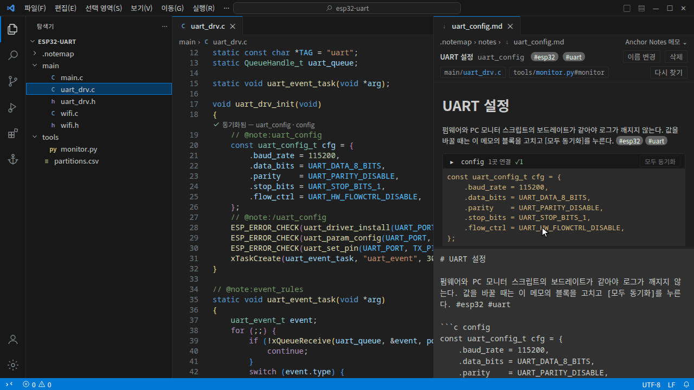
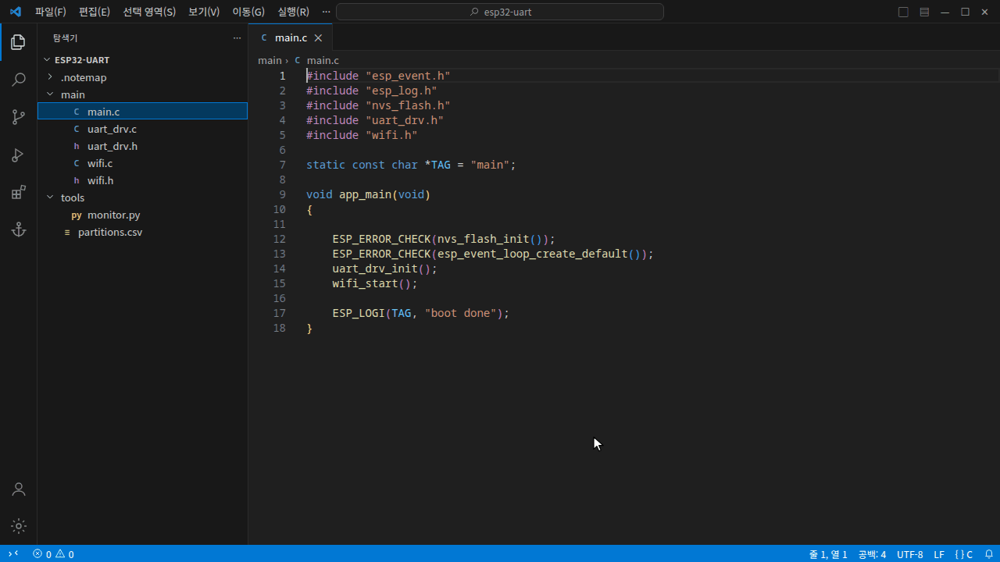
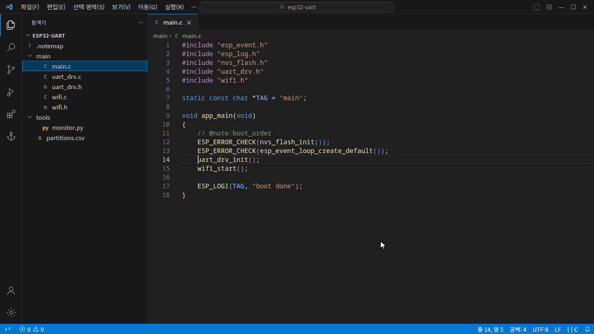

# Anchor Notes

코드 줄에 **마크다운 메모**를 붙이고, 메모에 적은 **코드를 소스와 동기화**하는 VSCode 확장입니다.

## 메모 속 코드를 소스와 동기화



메모의 코드 블록을 소스의 한 범위와 연결합니다. 메모를 고치면 **● 반영 대기**, **[동기화]** 를 누르면 코드가 바뀝니다.

## 코드 줄에 메모



줄에서 **`Ctrl+;` `M`** → 라벨 입력. 그 줄에 마커(`// @note:라벨`)가 들어가고 메모가 열립니다. 마커에 마우스를 올리면 메모가 보입니다.

---

## 코드 동기화

**연결** — 소스에서 코드를 선택하고 우클릭 → *메모 코드와 연결* (`Ctrl+;` `L`).

| 선택 | 연결 단위 |
|---|---|
| 줄 전체 | 줄 단위. 범위 마커 `@note:라벨` ~ `@note:/라벨` 사이의 줄들 |
| 줄 일부 (값 하나 등) | 열 단위. 그 글자 부분만 |

메모 쪽 코드 블록은 펜스 뒤에 이름을 붙여 구별합니다 (블록이 하나뿐이면 생략 가능).

````markdown
```c config
const uart_config_t cfg = { .baud_rate = 115200 };
```
````

**상태** — 메모 에디터의 블록 머리 줄과 소스의 마커 위 줄에 표시됩니다.

| 표시 | 상태 | 버튼 |
|---|---|---|
| ✓ | 같음 | [열기] |
| ● | 메모만 바뀜 | [동기화] — 메모 내용을 코드에 씀 |
| ! | 코드가 바뀜 | [메모로 덮기] · [메모에 반영] |
| ✕ | 코드에서 못 찾음 | [다시 고르기] · [연결 끊기] |

메모를 저장해도 코드는 바뀌지 않습니다. 코드는 버튼을 누를 때만 바뀝니다.

**한 번만 넣기** — 우클릭 → *메모 코드 넣기* (`Ctrl+;` `I`). 연결 없이 커서 위치에 복사합니다.

## 메모

- **만들기·열기** — `Ctrl+;` `M` 또는 `Ctrl+Alt+M`. 마커를 직접 쳐도 되고, `@note:` 뒤에서 라벨이 자동완성됩니다.
- **메모 에디터** — 위는 미리보기, 아래는 입력. 제목을 누르면 편집, [이름 변경]은 메모 파일과 모든 마커의 라벨을 한 번에 바꿉니다. 앵커 칩을 누르면 그 코드로 갑니다.
- **파일에 메모** — 주석을 못 쓰는 파일(이미지, JSON 등)은 탐색기 우클릭 → *이 파일에 메모*.
- **태그** — 본문에 `#태그`. 메모 에디터에서 누르거나 둘러보기에서 `#태그`로 찾습니다.

## 둘러보기

액티비티 바의 닻 아이콘 또는 `Ctrl+;` `B`.



모든 메모를 파일별·태그별로 보고 검색합니다. 항목을 누르면 메모, 오른쪽 칩을 누르면 코드 위치로 갑니다. 메모 없는 마커는 맨 아래에 모입니다.

## 마커 문법

| 쓰는 법 | 뜻 |
|---|---|
| `@note:라벨` | 메모 `라벨`을 이 자리에 붙임 |
| `@note:라벨#id` | 한 파일에 같은 라벨 마커를 여럿 둘 때 구별 |
| `@note:/라벨` | 앞의 같은 마커와 짝지어 범위를 닫음 (동기화용) |

- 라벨 = 메모 파일 이름. 워크스페이스 전체에서 하나뿐입니다.
- 공백과 `/ \ : * ? " < > | # `` ` `` 는 쓸 수 없습니다.
- 같은 라벨을 여러 곳에 쓰면 한 메모가 그 자리들을 모두 가리킵니다.

## 단축키

`Ctrl+;` 를 누르고 뗀 뒤 글자를 누릅니다 (macOS는 `Cmd`).

| 키 | 명령 |
|---|---|
| `M` | 이 줄에 메모 (`Ctrl+Alt+M`과 같음) |
| `L` | 메모 코드와 연결 |
| `I` | 메모 코드 넣기 |
| `B` | 둘러보기 |
| `R` | 마커 다시 찾기 |

## 저장 형식

메모 하나 = `.notemap/notes/{라벨}.md` 파일 하나. git으로 같이 관리되고 Obsidian에서도 열립니다.

```markdown
---
label: uart_config
title: UART 설정
anchors:
  - marker: main/uart_drv.c
    block: config
    hash: f2f99e90
created: 2026-09-28T10:00:00.000Z
updated: 2026-09-28T10:05:00.000Z
---
# UART 설정
...
```

줄 번호는 저장하지 않습니다. 위치는 코드 안의 마커가 정합니다. frontmatter에 직접 넣은 다른 키는 보존됩니다.

## 설정

| 설정 | 기본값 | 설명 |
|---|---|---|
| `anchorNotes.markerPrefix` | `@note:` | 마커 앞부분 |
| `anchorNotes.exclude` | `**/node_modules/**` 등 | 마커를 찾지 않을 경로 (glob) |

## 알아 둘 점

- 여러 폴더 워크스페이스에서는 첫 번째 폴더만 씁니다.
- `git pull`처럼 VSCode 밖에서 바뀐 내용은 **마커 다시 찾기**(`Ctrl+;` `R`)로 맞춥니다.

## 개발

```sh
npm install
npm run build      # dist/
npm test           # unit tests
npm run package    # .vsix
```

VSCode로 이 폴더를 열고 **Ctrl+F5**. 예제 프로젝트는 `examples/esp32-uart/`.

## 라이선스

[MIT](LICENSE)
